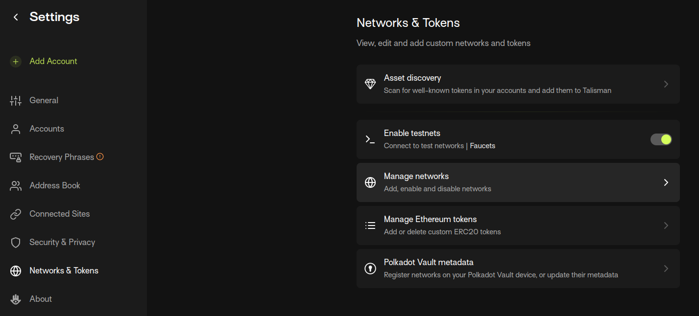
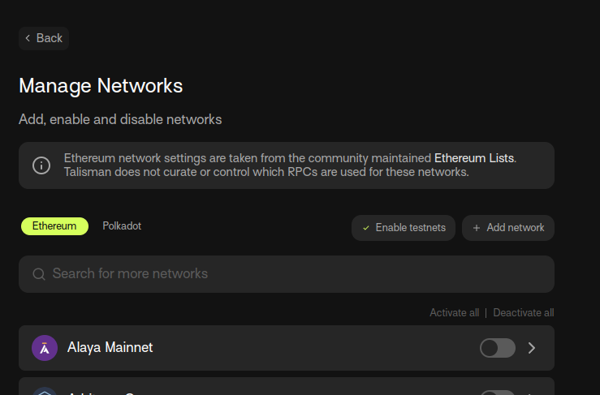

# Join the World Mobile DevNet

Welcome, lets start!

## 1. Minimal Server Requirnments

Operating System: Ubuntu 22.04

CPU: 2x vCPU

Memory: 8 GB

Storage: ~250 GB

## 2. Set up Operating System

Login to your server and access the terminal, for example using SSH connection. 

`do not use the root user - you will need to create a new user account and add it to sudo group`


Install dependencies: 

```bash
sudo apt update && sudo apt upgrade
sudo apt install -y curl
```

### Firewall
The p2p port `30333` needs to be open so your Validator can communicate, either with only your full node or the entire network.  
Make sure the port is open in your cloud / network configuration.

### Set Up UFW Firewall
First set some defaults
```bash
sudo ufw default deny incoming
sudo ufw default allow outgoing
```

To allow port `30333` and ssh access on port `22` in ufw on your Validator do:
```bash
sudo ufw allow 30333
sudo ufw limit proto tcp from any to any port 22
```

The RPC port `9944` on your Validator should be blocked from the outside.  This is already covered by our default deny incoming.

Enable the firewall:
```bash
sudo ufw enable
sudo ufw reload
sudo systemctl restart ssh
sudo ufw status
```

## 3. Install Aya-Node

[Release DevNet AyA Node v0.2.0](https://github.com/worldmobilegroup/aya-node/releases/tag/devnet-v.0.2.0)

Download and copy the `aya-node` and `wm-devnet-chainspec.json` files to your server. The guide aims to be compatible with building from source code so we will adjust file paths. To get the same folder structure as for the build from source option, create the folder `aya-node/target/release` and copy the `aya-node` binary into it. The `wm-devnet-chainspec.json` would be expected in the folder `aya-node/`

NOTE: `${USER}` is a global variable that returns your username.  You do not need to replace this!

```bash
cd /home/${USER}
mkdir -p aya-node/target/release
cd aya-node
wget https://github.com/worldmobilegroup/aya-node/releases/download/devnet-v.0.2.0/wm-devnet-chainspec.json
wget -P target/release https://github.com/worldmobilegroup/aya-node/releases/download/devnet-v.0.2.0/aya-node
chmod +x target/release/aya-node
```

We also need to create the script that we will use later to split our rotated session keys.

```bash
mkdir -p utils/session_key_tools
nano utils/session_key_tools/split_session_key.sh
```


Paste in the following text into Nano and save with CTRL-X
```bash
#!/usr/bin/env bash
set -e

if [[ $# -ne 1 ]]; then
    echo "Please provide a session key as parameter to the script!"
    exit 1
else
    SESSION_KEY=$1
    if [[ ! ${#SESSION_KEY} -eq 194 ]]; then
        echo "Please provide a valid session key!"
        exit 1
    fi
fi

echo "------------------------------------"
echo "Your session keys:"
echo AURA_SESSION_KEY=${SESSION_KEY:0:66}
echo GRANDPA_SESSION_KEY=0x${SESSION_KEY:66:64}
echo IM_ONLINE_SESSION_KEY=0x${SESSION_KEY:130:64}
echo "------------------------------------"
```
Now make the file executable
```bash
chmod +x utils/session_key_tools/split_session_key.sh
```


## 4. Setting Up systemd
We want our validator to start automatically with the server and be restarted automatically. For that purpose we create a systemd service (Ubuntu 22.04).

First we create a startup script for the AyA-Node.

Make sure the path to the aya-node binary is correct in the command below. It is expected you cloned and compiled the repository on the validator machine in your users home folder. In this case the aya-node would be located in `/home/myuser/aya-node/target/release`.

Set AyA Home Path to the folder were your aya-node binary is located: 

```bash
export AYA_HOME=/home/${USER}/aya-node
```

Set `AYA_HOME` on server start: 
```bash
sudo bash -c "echo 'export AYA_HOME=/home/${USER}/aya-node' >> /etc/bash.bashrc"
```

Create Startup Script: 

```bash
echo '#!/usr/bin/env bash' > start_aya_validator.sh
echo "${AYA_HOME}/target/release/aya-node \
    --base-path ${AYA_HOME}/data/validator \
    --validator \
    --chain ${AYA_HOME}/wm-devnet-chainspec.json \
    --port 30333 \
    --rpc-port 9944 \
    --log info \
    --prometheus-external \
    --bootnodes /dns/devnet-rpc.worldmobilelabs.com/tcp/30340/ws/p2p/12D3KooWRWZpEJygTo38qwwutM1Yo7dQQn8xw1zAAWpfMiAqbmyK" >> start_aya_validator.sh
sudo chmod +x ./start_aya_validator.sh
```

`NOTE: If you want to set up a second Aya DevNet Node at the same external address use a different port eg: 30334`

Let us test that the validator starts by executing the script we just created
```bash
./start_aya_validator.sh
```

The validator should start syncing, if there is a problem check the path to the `aya-node` binary and the `wm-devnet-chainspec.json`.

Stop the aya-node again by pressing Ctrl+C.

### Create a systemd service
Next we create the systemd service:

```bash
sudo tee /etc/systemd/system/aya-node.service > /dev/null <<EOF
#Start the Aya validator
[Unit]
Description=AyA Node
After=network.target

[Service]
WorkingDirectory=${AYA_HOME}
ExecStart="${AYA_HOME}"/start_aya_validator.sh
User=${USER}
Restart=always
RestartSec=90
#Set the maximum number of file descriptors
LimitNOFILE=4096

[Install]
WantedBy=multi-user.target
EOF
```

Enable the service:
```bash
sudo systemctl enable aya-node.service
```

Start the node via systemd:
```bash
sudo systemctl start aya-node.service
```

Check the service is running: 
```bash
sudo systemctl status aya-node.service
```

If there is a problem check that all paths are fine first, that is the most common problem. 

You can look at the logs with:

```bash
sudo journalctl -u aya-node.service
```

If you want to follow the logs use: 

```bash
sudo journalctl -f -u aya-node.service
```

In case your systemd service is not working properly you can find debugging information in this log. 

If everything worked out you should have a running full node / validator which is syncing with the blockchain (but not validating blocks).
You can see in the logs that the node is importing blocks. 

(If you just wanted to setup a full node and not a validator you can stop here.)


## 5. Prepare Key Setup
**The mnemonic used in this tutorial is an EXAMPLE and is PUBLICLY USED for ALICE, BOB,... DO NOT USE it; Replace *"bottom drive obey lake curtain smoke basket hold race lonely fit walk"* with your own generated mnemonic.** 


### Using the Aya-Node Binary to generate keys
Keys can be generated and inspected with the aya-node binary

Generate key:
```bash
./target/release/aya-node key generate
```

Example Output: 
```
Secret phrase:       bottom drive obey lake curtain smoke basket hold race lonely fit walk
  Network ID:        substrate
  Secret seed:       0xe5be9a5092b81bca64be81d212e7f2f9eba183bb7a90954f7b76361f6edb5c0a
  Public key (hex):  0xd43593c715fdd31c61141abd04a99fd6822c8558854ccde39a5684e7a56da27d
  Account ID:        0xd43593c715fdd31c61141abd04a99fd6822c8558854ccde39a5684e7a56da27d
  Public key (SS58): 5GrwvaEF5zXb26Fz9rcQpDWS57CtERHpNehXCPcNoHGKutQY
  SS58 Address:      5GrwvaEF5zXb26Fz9rcQpDWS57CtERHpNehXCPcNoHGKutQY
```

You should make a copy of these keys and keep them safe!

Inspect key: (example below is for inspecting ALICE's seed phrase - replace it with your own seed )
```bash
./target/release/aya-node key inspect "bottom drive obey lake curtain smoke basket hold race lonely fit walk"
```

## 6. Set Validator Private Keys

### Adding private keys to the Validator keyring

To setup the validator we need to add the secret keys to the keyring on the validator machine. On the machine running the validator, navigate to the `aya-node` folder.

```bash
cd /home/${USER}/aya-node
```

We need to add three keys: the AURA_KEY, GRANDPA_KEY and IM_ONLINE_KEY.  For a simple set up these three keys are the same.  In a more complicated set up you may want to use key derivation, in which case the secret seeds of the ed25519 and sr25519 scheme might differ! The AURA_KEY and IM_ONLINE_KEY is the same sr25519 secret seed, the GRANDPA_KEY is the ed25519 secret seed.  
You also need to set the base path of the node, the path were all data for the node is stored. We use `data/validator`, make sure the path is accessible. 

Enter your Secret Seed keys from Step 5 above:  ( REPLACE THIS EXAMPLE SECRET SEED WITH YOUR OWN!! )
```bash
export SECRET_SEED=0xe5be9a5092b81bca64be81d212e7f2f9eba183bb7a90954f7b76361f6edb5c0a
```

Now just Copy and Paste the code below - it uses the `SECRET_SEED` variable you just entered in the previous step

```bash
./target/release/aya-node key insert \
    --base-path data/validator \
    --chain wm-devnet-chainspec.json \
    --key-type aura \
    --scheme sr25519 \
    --suri "${SECRET_SEED}";

./target/release/aya-node key insert \
    --base-path data/validator \
    --chain wm-devnet-chainspec.json \
    --key-type gran \
    --scheme ed25519 \
    --suri "${SECRET_SEED}";
    
./target/release/aya-node key insert \
    --base-path data/validator \
    --chain wm-devnet-chainspec.json \
    --key-type imon \
    --scheme sr25519 \
    --suri "${SECRET_SEED}";
```

Check if keys were added:
```bash
ls -l data/validator/chains/aya_devnet/keystore/;
```

The command should output three files.

## 7. Session Keys

The aya-node is able to operate now, but the blockchain does not know of the validator yet. To make it possible for a validator to join the network as block producer it must commit its session keys and get added to the validator set by the ruling chain authority. The session keys are public keys derived from the private keys you just added in step 6.. The rotation must be restricted to the operator only. Node operators should for this purpose make sure the RPC API of the validator is not exposed to the public.

To get your session keys you need to start the node and make a local RPC call. If you followed the previous steps your node should be already running as systemd service. 

Check the status of your node service:

```bash
sudo systemctl status aya-node.service
```

Check if the node is importing blocks: 

```bash
sudo journalctl -f -u aya-node.service
```

If your node is running correctly you can trigger a key rotation via the local RPC interface using curl. Make sure you have added the AURA, GRANDPA and IMONLINE keys to your validator. Obtain Session Keys from Node API: 

```bash
curl -H "Content-Type: application/json" -d '{"id":1, "jsonrpc":"2.0", "method": "author_rotateKeys"}' http://localhost:9944/
```
**ATTENTION: This endpoint triggers your key rotation! Calling it means rotating your keys! Do not call it again after you set your keys already (Step 9), otherwise you invalidate them and need to set the keys again. The RPC API must be locked due to this reason and only accessible by the node operator, so no unintentionally key rotation is performed.**

Example Output: 
`
{"jsonrpc":"2.0","result":"0x42ad00eae2336671febcce956db3e5716b4ad7fb3cc8bb576463882f3b3eab256091e0b8a8e08eef8b13153a05800712a4b661a3470f817dc002fd3c63649f26305a8ce33139a89753136bb5c77ebcc38ace19ebb27d96ad7a52c0ee5ebebc77","id":1}
`

The output contains the AURA, GRANDPA and IMONLINE public keys in one large string, we need to split the string up. Each key has 32 bytes, the string is hex encoded, so each key has 64 characters. Each of the keys needs a prefix '0x' to indecate it is hex encoded. The output starts already with '0x' so the first key starts behind the '0x' and is 64 characters long. The second key starts at the 65 character, it has no '0x' prepend yet so we do that. The next key starts at character 130 and also needs a '0x' prefix. All keys should have the same length (32byte or 64 characters) and have a 0x as prefix. 

Tip: Just use the script `./utils/session_key_tools/split_session_key.sh <YOUR_LONG_TEXT_STRING>` 
 
Example: 
```
./utils/session_key_tools/split_session_key.sh 0x42ad00eae2336671febcce956db3e5716b4ad7fb3cc8bb576463882f3b3eab256091e0b8a8e08eef8b13153a05800712a4b661a3470f817dc002fd3c63649f26305a8ce33139a89753136bb5c77ebcc38ace19ebb27d96ad7a52c0ee5ebebc77
------------------------------------
Your session keys:
AURA_SESSION_KEY=0x42ad00eae2336671febcce956db3e5716b4ad7fb3cc8bb576463882f3b3eab25
GRANDPA_SESSION_KEY=0x6091e0b8a8e08eef8b13153a05800712a4b661a3470f817dc002fd3c63649f26
IM_ONLINE_SESSION_KEY=0x305a8ce33139a89753136bb5c77ebcc38ace19ebb27d96ad7a52c0ee5ebebc77
------------------------------------
```

Put the keys aside, you will need them in the next step. 


## 8. Setup Wallet & Connect to Polkadot-JS Development Front-End

To set your session keys you need to send a transaction to the blockchain. The transaction registers the session keys with an EVM account. You need a wallet with your EVM account to send the needed transation, so we setup the Talisman wallet in the next step. 

### Setup Wallet and Restore Validator Account in Talisman
We want to add our account to a wallet and connect with the development frontend. You can use another account as the one generated for your validator to register the session keys but you need to set the correct session keys otherwise the validator cannot get identified.

### Install Talisman
To be able to interact with AyA's advanced functionallty, a wallet able to connect to polkadot-js is needed. MetaMask is not able to do this out of the box, we recommend to use the Talisman wallet for now.

**We will use the well known mnemonic from Alice for this tutorial as an example, this mnemonic is publicly known and should only be used for demonstration purposes:**

```
bottom drive obey lake curtain smoke basket hold race lonely fit walk
```

#### Install the Talisman Browser Extension

Go to the [Talisman Website](https://www.talisman.xyz/) and follow the instructions to install the talisman wallet extension.

#### Restore or Generate a Ethereum Wallet

Use your mnemonic seed to restore the wallet in Talisman or create a new Ethereum account. 


#### Add AyA DevNet to Talisman

DevNet Public RPC Endpoint: `devnet-rpc.worldmobilelabs.com`

It is possible to connect via REST API `https://devnet-rpc.worldmobilelabs.com` or websocket `wss://devnet-rpc.worldmobilelabs.com`. We need to add the network as ethereum network as well as polkadot network to have full functionallity. Polkadot-js front-end will use the websocket whereas the wallet will use the REST Api. 

In Talisman go to `Settings -> Networks & Tokens -> Manage Networks`


Make sure you check `Enable testnets`

You can find two buttons to select the different network types `Ethereum` and `Polkadot`:


For each of the network types we need to add a network. Select the network type via the buttons and click `+ Add network` for each of them.

Add the following network to Talisman (Ethereum):


Add the following Network to Talisman (Polkadot):


### Get FERN
You need to get some FERN tokens from the faucet to pay for transaction fees. 
Go to the [Faucet](https://devnet-faucet.worldmobilelabs.com/) paste your EVM account address and request some. 


If you go back to Talisman you will notice that it shows you have 20 FERN. These are actually the same 10 FERN tokens being viewed both from the Etherum connection and the Polkadot connection the Aya DevNet.  You only really have 10 FERN tokens.

### Access the Front-End

Go to the Polkadot-JS development front-end and connect your Talisman wallet and account to the Polkadot-JS front end. You should see your account now on the webiste when you navigate to [Accounts](https://polkadot.js.org/apps/?rpc=wss%3A%2F%2Fdevnet-rpc.worldmobilelabs.com%3A#/accounts). If the setup of the RPC endpoints worked correctly you are able to sign and submit transactions with that account.

[Front-End](https://polkadot.js.org/apps/?rpc=wss%3A%2F%2Fdevnet-rpc.worldmobilelabs.com%3A#/explorer)

Updating Metadata:

In some cases you need to update the metadata on your wallet. 
If that is needed a message will pop up in the front-end. Navigate to `Settings -> Metadata` and confirm the metadata update.


## 9. Set Session Keys

To become a validator two more steps are needed. First you need to submit your session keys and second you need to let us know about your validator, so we can add it to the authority set. It takes two epochs after you were added to the authority set before you are part of the active, block producing authority set. An epoch last for 24 hours. 

If one of the session keys does not match the ones active in your validator, your validator cannot produce blocks and will be kicked from the authority set. 
If you do not provide ImOnline messages during an epoch you are getting kicked two epochs later (this can happen when the IMONLINE key is wrong or your validator is offline). We can add you again so no worries, but we do not observe your validator status so you need to let us know.

### Submit Session Keys
To submit the session keys you obtained in the step before you need a working Polkadot-JS front-end and your account needs to have funds to pay for transaction fees. The wallet registering the session keys does not need to be the one generated for the validator, but the session keys must match! Only you (the operator) should know your session keys when you triggered a rotation and only you should be able to rotate session keys. It is not possible to register the same session keys twice.

Go to the [Front-End](https://polkadot.js.org/apps/?rpc=wss%3A%2F%2Fdevnet-rpc.worldmobilelabs.com%3A#/explorer) and navigate to `Developer -> Extrinsics`.


Select the validator account you imported into Talisman before.

Select the `session` pallet from the extrinsic category pull down menu. 

Select `setKeys(keys,proof)` from the function selector pull down menu.

Insert the Aura-Key into the first field

Insert the Grandpa-Key into the second field. 

Insert the ImOnline-Key into the third field. 

For the proof enter `0x`


Submit the transaction and sign with your wallet.

If the transaction was submitted sucessfully you can check that your keys have been set:

Go to: `Developer -> Chain State`

Select the `session` pallet in the state query. 

Select the function `nextKeys(AccountId20):Option<AyaRuntimeOpaqueSessionKeys>`.

Select your Account and submit the request by clicking on the `+`.

Example Output: 
```
{
  aura: 0x42ad00eae2336671febcce956db3e5716b4ad7fb3cc8bb576463882f3b3eab25
  grandpa: 0x6091e0b8a8e08eef8b13153a05800712a4b661a3470f817dc002fd3c63649f26
  imOnline: 0x305a8ce33139a89753136bb5c77ebcc38ace19ebb27d96ad7a52c0ee5ebebc77
}
```

## 10. Register Validator

You have done all it needs, the only thing left is to let us know about your validator. Go to this [Form](https://forms.gle/RXjEqJuRGp9AwwBe9) and fill the information. We check twice a day (mornings and evenings in CET) for new validators and add them to the authority set. It takes two epochs until your validator joins the active authority set, an epoch is 24 hours so it can take 3 to 4 days before your validator becomes active. 

To fill the form you will need:
- the fingerprint of your ENNFT on Cardano mainnet
- the address you used to register you session keys ( Talisman Ethereum wallet address )
- your valid email address
- your discord username


## 11. Securing my Validator
We have setup a plain validator in this guide and connected it directly to the network. It is possible to have the
validator behind a full node which is exposed to the public. The validator only connects to that full node in this case and not allow connections from the outside.

Setup a full node which connects to the network in the way described in this guide. All the key related steps can be ignored for a full node. When you setup your validator you do not give the public bootnode in the `--bootnodes` parameter, but your own full node. With additonal measuremeants (e.g. cloud firewall or ufw) you can limit the connections to your validator. Only the p2p port (default 30333) needs to be open if you want to connect to the validator with another node. For example we could open the port 30333 only for the internal network IP address of our full node.
